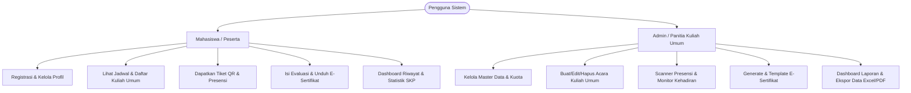
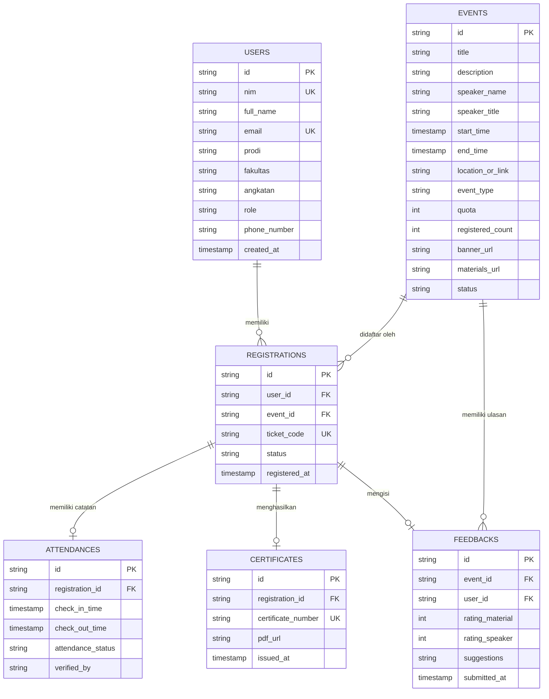

# 📋 Rencana Implementasi (Implementation Plan)
## Website Sistem Informasi Mahasiswa Kuliah Umum (SIM-KU)

Dokumen ini berisi panduan terstruktur, spesifikasi teknis, rancangan arsitektur, dan pelacak progres (*progress tracker*) untuk perancangan dan pembangunan **Website Sistem Informasi Kuliah Umum**.

---

## 📌 1. Ringkasan & Tujuan Proyek

### 1.1 Latar Belakang
Sistem Informasi Kuliah Umum (SIM-KU) adalah platform berbasis web responsif yang dirancang untuk memfasilitasi seluruh siklus pelaksanaan kuliah umum bagi mahasiswa, dosen/panitia, dan administrator kampus, mulai dari registrasi akun, pendaftaran acara, presensi digital, hingga penerbitan e-sertifikat otomatis.

### 1.2 Tujuan Utama
1. **Otomatisasi Pendaftaran:** Mengurangi proses manual pendaftaran kuliah umum dengan sistem kuota waktu nyata (*real-time*).
2. **Presensi Digital Terintegrasi:** Memudahkan pencatatan kehadiran menggunakan pemindaian QR Code (Check-in & Check-out).
3. **E-Sertifikat Otomatis:** Mengeluarkan sertifikat digital resmi setelah mahasiswa mengisi kuesioner evaluasi dan diverifikasi kehadirannya.
4. **Sentralisasi Data & Dashboard Analitik:** Menyediakan visualisasi data bagi mahasiswa (riwayat keikutsertaan, sertifikat) dan panitia (statistik pendaftar, tingkat kehadiran).

---

## 👥 2. Peran Pengguna (*User Roles & Permissions*)



---

## 🏗️ 3. Arsitektur Sistem & Rekomendasi Tech Stack

| Lapisan (*Layer*) | Teknologi yang Direkomendasikan | Alternatif |
| :--- | :--- | :--- |
| **Frontend / Web UI** | **Flutter Web (Responsive Material 3)** | Next.js / React (Tailwind CSS) |
| **State Management** | **Flutter Riverpod / BLoC Pattern** | Provider |
| **Routing** | **GoRouter (Web friendly URLs)** | AutoRoute |
| **Backend & Database** | **Supabase (PostgreSQL + Auth + Storage)** | Firebase (Firestore + Auth + Storage) |
| **Presensi & QR Code** | **mobile_scanner / qr_flutter** | html5-qrcode |
| **Sertifikat Generator**| **PDF Dart Engine / Cloud Function (Canvas/Puppeteer)** | syncfusion_flutter_pdf |

---

## 🗄️ 4. Struktur Database & Model Data (ERD)



---

## 📊 5. Roadmap & Pelacak Progres Implementasi (*Progress Tracker*)

### 🚦 Ringkasan Status Progres

| Modul / Fase | Status | Target Persentase |
| :--- | :---: | :---: |
| **Fase 1: Inisialisasi Fondasi & Konfigurasi Lingkungan** | 🟡 Siap Dimulai | **0%** |
| **Fase 2: Modul Autentikasi & Profil Mahasiswa** | ⚪ Menunggu | **0%** |
| **Fase 3: Modul Dashboard (Mahasiswa & Admin)** | ⚪ Menunggu | **0%** |
| **Fase 4: Modul Katalog Kuliah Umum & Registrasi Tiket** | ⚪ Menunggu | **0%** |
| **Fase 5: Modul Presensi Digital (QR Code Scanner)** | ⚪ Menunggu | **0%** |
| **Fase 6: Modul Evaluasi (Feedback) & E-Sertifikat Otomatis** | ⚪ Menunggu | **0%** |
| **Fase 7: Pengujian Terpadu, Optimasi Web & Peluncuran** | ⚪ Menunggu | **0%** |

---

## 🛠️ 6. Rincian Pekerjaan per Fase (*Work Breakdown Structure*)

### 📍 Fase 1: Inisialisasi Fondasi & Desain Sistem
> **Fokus:** Menyiapkan struktur direktori kode (*clean architecture*), tema visual profesional (Material 3), dan koneksi basis data.

- [ ] **1.1** Penataan arsitektur folder (`core`, `features`, `shared`, `models`, `services`).
- [ ] **1.2** Konfigurasi tema global (Palet warna institusi/akademik, Tipografi Google Fonts: Poppins/Inter, Dark/Light Mode).
- [ ] **1.3** Setup State Management (Riverpod/Bloc) dan Sistem Routing (`go_router`) dengan dukungan URL navigasi web.
- [ ] **1.4** Konfigurasi Backend/Database (Supabase / Firebase initialization & konfigurasi API).
- [ ] **1.5** Pembuatan komponen UI dasar (Button, InputField, Dialog, Card, Sidebar, Navbar).

---

### 📍 Fase 2: Modul Autentikasi & Akun Pengguna
> **Fokus:** Alur pendaftaran akun mahasiswa baru, validasi NIM/Email, login multi-role, dan profil.

- [ ] **2.1** Halaman Registrasi Mahasiswa:
  - Input: NIM, Nama Lengkap, Email Kampus/Pribadi, Fakultas, Program Studi, Angkatan, No. WhatsApp, Password.
  - Validasi form (panjang NIM, format email, konfirmasi password).
- [ ] **2.2** Halaman Login:
  - Login dengan NIM / Email + Password.
  - Opsi *Remember Me* & Fitur Lupa Password (*Reset Password via Email*).
- [ ] **2.3** Role-Based Access Control (RBAC):
  - Routing guard (mencegah mahasiswa mengakses menu admin dan sebaliknya).
- [ ] **2.4** Halaman Profil Pengguna:
  - Tampilan identitas mahasiswa lengkap.
  - Ubah foto profil, edit nomor kontak, dan ganti kata sandi.

---

### 📍 Fase 3: Modul Dashboard Mahasiswa & Admin
> **Fokus:** Pusat informasi visual ringkas dan navigasi cepat setelah login.

- [ ] **3.1 Dashboard Mahasiswa:**
  - **Statistik Header:** Jumlah kuliah umum diikuti, sertifikat terkumpul, agenda mendatang.
  - **Widget Agenda Terdekat:** Kartu kuliah umum yang telah didaftari lengkap dengan countdown waktu.
  - **Banner Pengumuman:** Info penting terkait jadwal kuliah umum akbar.
  - **Aksi Cepat:** Tombol unduh tiket QR, akses materi cepat.
- [ ] **3.2 Dashboard Admin / Panitia:**
  - **Metrik Utama:** Total mahasiswa terdaftar, total acara aktif, total pendaftar bulan ini, rata-rata kehadiran.
  - **Tabel Monitoring Acara:** Status pendaftaran terbuka/penuh/selesai.
  - **Grafik Partisipasi:** Grafik keikutsertaan per program studi/fakultas.

---

### 📍 Fase 4: Modul Katalog Kuliah Umum & Pendaftaran Tiket
> **Fokus:** Eksplorasi acara kuliah umum dan mekanisme reservasi kursi.

- [ ] **4.1 Halaman Katalog Kuliah Umum:**
  - Tampilan Grid/List Card acara dengan cover banner menarik.
  - Filter berdasarkan: Fakultas/Umum, Bulan, Status Kuota (Tersedia / Penuh), Tipe (Online / Offline).
  - Kolom pencarian berdasarkan judul atau nama narasumber.
- [ ] **4.2 Halaman Detail Kuliah Umum:**
  - Info pembicara (Foto, Nama, Jabatan/Instansi, Profil singkat).
  - Waktu pelaksanaan, durasi, lokasi (Ruang Auditorium / Link Zoom).
  - Kuota sisa secara real-time.
  - Tombol aksi **"Daftar Sekarang"** / **"Batalkan Pendaftaran"**.
- [ ] **4.3 Manajemen Tiket Digital:**
  - Generate Tiket Digital dengan **Unique QR Code & Kode Reservasi**.
  - Modal/Halaman tiket yang dapat disimpan atau ditunjukkan saat presensi.

---

### 📍 Fase 5: Modul Presensi Digital (QR Code Attendance)
> **Fokus:** Pencatatan kehadiran yang cepat, akurat, dan terhindar dari titip absen.

- [ ] **5.1 Sisi Mahasiswa:**
  - Halaman untuk memunculkan QR Code Tiket miliknya.
  - Atau fitur pemindai kamera untuk memindai QR Code sesi yang ditampilkan di proyektor auditorium.
- [ ] **5.2 Sisi Panitia / Admin (Scanner App):**
  - Pemindai QR Code Panitia menggunakan kamera perangkat/webcam.
  - Validasi instan:
    - ✅ *Berhasil Check-in* (Status pendaftar sah).
    - ⚠️ *Peringatan* (Sudah pernah check-in sebelumnya).
    - ❌ *Gagal* (Belum terdaftar pada sesi ini).
- [ ] **5.3 Monitoring Kehadiran Realtime:**
  - Daftar hadir live yang dapat dipantau panitia saat acara berlangsung.

---

### 📍 Fase 6: Modul Evaluasi, Materi & E-Sertifikat Otomatis
> **Fokus:** Penyerahan feedback peserta, pembagian materi presentasi, dan penerbitan sertifikat digital.

- [ ] **6.1 Modul Bahan/Materi Kuliah Umum:**
  - Akses unduh slide presentasi (PDF/PPT) dan rekaman (jika daring) khusus untuk peserta yang hadir.
- [ ] **6.2 Form Kuesioner Evaluasi:**
  - Penilaian bintang untuk pembicara, kesesuaian materi, dan fasilitas acara.
  - Kolom kritik & saran.
  - Status wajib diisi sebagai syarat membuka (*unlock*) tombol unduh sertifikat.
- [ ] **6.3 Generator E-Sertifikat Otomatis:**
  - Template sertifikat dinamis (Nama Mahasiswa, NIM, Judul Kuliah Umum, Tanggal, No. Surat Keputusan).
  - Verifikasi keaslian sertifikat via nomor unik atau QR verifikasi publik.
  - Tombol **"Unduh E-Sertifikat (PDF)"**.

---

### 📍 Fase 7: Pengujian, Optimasi Web & Deployment
> **Fokus:** Memastikan aplikasi bebas bug, cepat, aman, dan siap digunakan massal.

- [ ] **7.1 Responsive Web Testing:**
  - Uji tampilan pada Desktop (Full HD), Tablet, dan Layar Smartphone.
- [ ] **7.2 Security & Validation:**
  - Pencegahan pendaftaran ganda (*race conditions* pada sisa kuota).
  - Enkripsi password & proteksi data pribadi mahasiswa.
- [ ] **7.3 Build & Deployment:**
  - Build Flutter Web optimasi (`--release --web-renderer canvaskit/html`).
  - Hosting di platform web modern (Vercel / Firebase Hosting / Server Kampus).

---

## 📅 7. Estimasi Jadwal Pengerjaan (Timeline Sederhana)

```
Minggu 1: Fase 1 (Setup Arsitektur & UI Kit) & Fase 2 (Auth & Profil)
Minggu 2: Fase 3 (Dashboard) & Fase 4 (Katalog Acara & Pendaftaran Tiket)
Minggu 3: Fase 5 (Presensi QR Code) & Fase 6 (Feedback & E-Sertifikat)
Minggu 4: Fase 7 (Testing, UAT, Optimasi Responsif & Go-Live)
```
